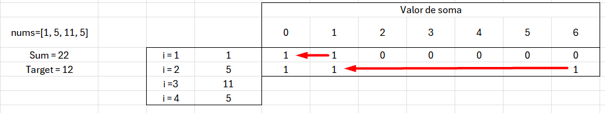
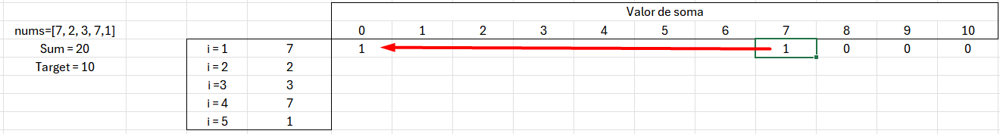
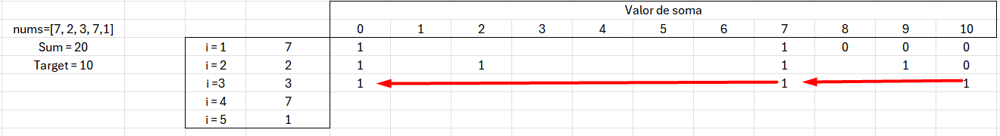

# Problema #416. Partition Equal Subset Sum

> 🔗 [Link para o problema no LeetCode](https://leetcode.com/problems/partition-equal-subset-sum/)

---

## 🧠 Descrição

Dado um vetor de inteiros `nums`, determine se é possível dividi-lo em **dois subconjuntos não vazios** com **soma igual**.
Ou seja, queremos saber se existe uma partição do array tal que a soma dos elementos de ambas as partes seja a mesma.

### 🧾 Exemplos

**Exemplo 1**
Entrada: `nums = [1, 5, 11, 5]`
Saída: `true`
Explicação: É possível formar dois subconjuntos: `[1, 5, 5]` e `[11]`.

**Exemplo 2**
Entrada: `nums = [1, 2, 3, 5]`
Saída: `false`
Explicação: Não existe forma de dividir em dois subconjuntos com a mesma soma.

---

## 📚 Estratégia Utilizada

### 1. Programação Dinâmica com Vetor de Booleans (`1D DP`)

* **Descrição**:
  O problema se reduz à clássica questão de **Subset Sum**:
  Podemos encontrar um subconjunto de `nums` cuja soma seja igual a `total/2`?

  * Calculamos a **soma total** do vetor.
  * Se a soma for **ímpar**, retornar `false` diretamente.
  * Caso contrário, definimos `alvo = soma / 2`.
  * Usamos um vetor booleano `dp[i]` onde `dp[i] = true` significa que é possível formar a soma `i` com elementos do vetor.
  * Começamos com `dp[0] = true` (soma 0 sempre é possível).
  * Para cada número `num` em `nums`, atualizamos o vetor `dp` de trás para frente:

    ```cpp
    for (int i = alvo; i >= num; i--) {
        dp[i] = dp[i] || dp[i - num];
    }
    ```

* **Tabela de saida dos exeplos**:
  Abaixo temos a tabela que mostra os valores do array dp conforme cada iteração ocorre para diferentes exemplos de entrada:

  `[1, 5, 11, 5]`
  Neste exemplo, o objetivo é alcançar a soma 11.
  A tabela mostra que, após processar os elementos 1 e 5, já conseguimos alcançar o valor 6 no array dp (ou seja, dp[6] = true).
  Isso indica que há um subconjunto com soma 6, que será complementado nas próximas iterações até alcançar o valor-alvo.
  

  `[7, 2, 3, 7,1]`
  Neste caso, a soma total é par, então o alvo é 10.
  Ao observarmos as iterações:

  Iteração 3 (após os elementos [7, 2, 3]): conseguimos marcar dp[10] = true, indicando que existe uma combinação desses elementos que soma exatamente 10.

  onstruída para isso foi: 3 → dp[3] = true, depois 3 + 7 → dp[10] = true.

  imagens abaixo ilustram a evolução do array dp passo a passo:
  
  
  
  

* **Complexidade**:

  * **Tempo**: `O(n * s)`
    Onde `n` é o número de elementos e `s = soma/2` (o valor-alvo).

  * **Espaço**: `O(s)`
    Vetor `dp` de tamanho `alvo + 1`.

* **Otimizações**:

  * Atualizar `dp` **de trás para frente** evita sobrescrever os valores que ainda serão usados na iteração atual.
  * Podemos sair do loop antecipadamente se `dp[alvo] == true`.

---

## 🧪 Seção de Estudos: Subset Sum & 1D Dynamic Programming

### 💡 Ideia-chave:

O problema é uma variante de **Subset Sum**, onde queremos verificar se existe uma combinação de números que soma exatamente `target`.

### ✅ Sobre a técnica de **DP 1D**:

* Usamos `dp[target]` para determinar se é possível atingir determinada soma com os elementos disponíveis.
* A transição é baseada na possibilidade de alcançar a soma `i` com ou sem o elemento atual:

  ```
  dp[i] = dp[i] || dp[i - num]
  ```

### 📌 Exemplo de Evolução do DP:

Com `nums = [1, 5, 11, 5]`, soma total = 22 → alvo = 11
Inicial: `dp = [true, false, false, ..., false]`
Após processar todos os números, `dp[11] = true`.

---

## ⚖️ Considerações Finais

* **DP 1D** é eficiente em tempo e espaço para esse problema.
* Caso a soma seja **ímpar**, a resposta será **sempre falsa**.
* A estratégia evita o uso de recursão com memoização, otimizando o espaço com um vetor simples.

---

## 🔢 Código (C++)

```cpp
class Solution {
public:
    bool canPartition(vector<int>& nums) {
        int soma = accumulate(nums.begin(), nums.end(), 0);
        if (soma % 2 == 1) {
            return false;
        }

        int alvo = soma / 2;
        vector<bool> dp(alvo + 1, false);
        dp[0] = true;

        for (int num : nums) {
            for (int i = alvo; i >= num; i--) {
                dp[i] = dp[i] || dp[i - num];
            }

            if (dp[alvo] == true) {
                break;
            }
        }

        return dp[alvo];
    }
};
```
