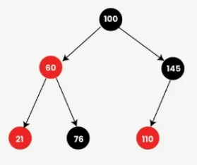

# Problema #500. Keyboard Row

> 🔗 [Link para o problema no LeetCode](https://leetcode.com/problems/keyboard-row/)

---

## 🧠 Descrição

Dado um vetor de palavras, precisamos retornar apenas aquelas que podem ser digitadas utilizando **uma única linha** do teclado QWERTY em inglês.
Por exemplo, a palavra `"Alaska"` pode ser digitada apenas com letras da segunda linha (`asdfghjkl`).

---

## 📚 Estratégias Utilizadas

### 1. Abordagem com `map<char, int>` (árvore balanceada)

* **Descrição**:
  Atribuímos a cada caractere uma linha do teclado (1, 2 ou 3) utilizando um `map<char, int>`.
  Para cada palavra, verificamos se todas as letras pertencem à mesma linha.
  Se sim, adicionamos a palavra ao vetor de retorno.

* **Complexidade**:

  * **Tempo**: `O(n * k + 26 * log 26)`
    Onde `n` é o número de palavras e `k` o tamanho médio de cada palavra.
  * **Espaço**: `O(n)` para o vetor de retorno e `O(26)` para o mapa.

* **Observações**:

  * O `map` é implementado como uma árvore balanceada do tipo Red-Black Tree.
  * Garante ordenação e busca em `O(log n)`.
  * Neste problema, a ordenação não é necessária — por isso, o uso de `unordered_map` (baseado em hash) seria mais eficiente.

---

### 🔁 Alternativa com `unordered_map<char, int>` (tabela de hash)

* **Descrição**:
  Mesma lógica da abordagem anterior, mas utilizando `unordered_map` para obter acesso em tempo constante médio (`O(1)`).

* **Complexidade**:

  * **Tempo**: `O(n * k)`
  * **Espaço**: `O(n)`

* **Vantagem**:
  Melhor desempenho prático, especialmente com grandes volumes de dados.

* **Motivo para não ter sido usada inicialmente**:
  Na minha primeira implementação utilizei `map` por familiaridade e simplicidade.
  Após revisar, percebi que `unordered_map` seria a estrutura ideal para este cenário.

---

## 🧪 Seção de Estudos: `map` e sua estrutura interna

* O `map` em C++ é implementado como uma **árvore binária balanceada**, geralmente uma **Red-Black Tree (RBT)**.
* Isso garante que as operações de **inserção, remoção e busca** ocorram em tempo `O(log n)`.
* A ordenação das chaves é automática — útil em muitos cenários, mas **irrelevante aqui**.

### ✅ Propriedades da Red-Black Tree:

1. Cada nó é **vermelho** ou **preto**.
2. A **raiz** é sempre preta.
3. **Nós vermelhos não podem ter filhos vermelhos** (sem dois vermelhos consecutivos).
4. Todo caminho da raiz até uma folha **contém o mesmo número de nós pretos**.
5. Todas as **folhas (nós nulos/NIL)** são pretas.

---

### 🌳 Exemplo de árvore **válida**:

- Uma árvore com as propriedades de cor e balanceamento corretamente aplicadas.

---

### ❌ Exemplo de árvore **inválida**:

Neste exemplo:

* Dois nós vermelhos consecutivos (`60` e `21`) violam a propriedade 3.
* Um dos caminhos para folha não possui o mesmo número de nós pretos, quebrando a propriedade 4.

---

## ⚖️ Comparativo com AVL

* As **AVL Trees** são geralmente **mais rigidamente balanceadas** que as Red-Black Trees.
* No entanto, isso resulta em **mais rotações** durante inserções e remoções.
* Em sistemas com muitas atualizações (insert/delete), as **Red-Black Trees** podem ser mais eficientes por necessitarem de **menos rotações**.

---

### 🔗 Fonte de pesquisa e para aprofundar no tema:

- [GeeksforGeeks - Red-Black Tree](https://www.geeksforgeeks.org/dsa/introduction-to-red-black-tree/)
- [Red-Black Tres: Intro in 4](https://www.youtube.com/watch?v=qvZGUFHWChY)
